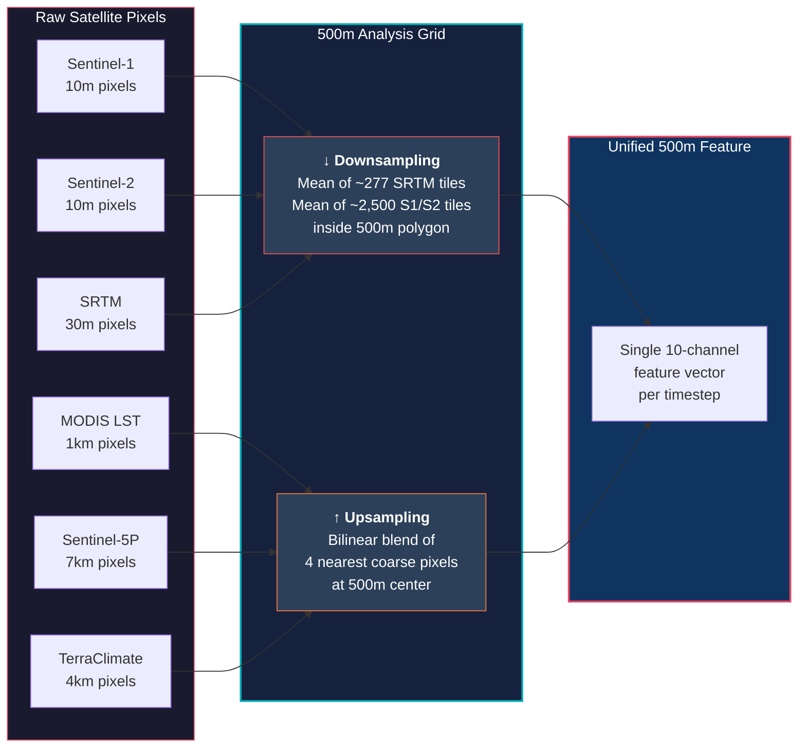

# Nepal Multi-Hazard Prediction System — Full Architecture

## End-to-End Pipeline Overview

```mermaid
flowchart TB
    subgraph PHASE1["<b>PHASE 1: Ground Truth Labeling</b>"]
        direction TB
        BIPAD["🏛️ Nepal BIPAD Portal<br/><i>Government Disaster Database</i>"]
        BL["bipad_labeler.py<br/><i>Filter: Landslide + Flood</i><br/><i>Date Range: 2021–2023</i>"]
        GEO["geocoder_script.py<br/><i>Municipality → Lat/Lon</i>"]
        GEN["generate_samples.py<br/><i>873 Positive + 4,365 Negative</i><br/><i>1:5 Ratio Balanced Sampling</i>"]
        CSV1[("sample_locations_raw.csv<br/>5,238 labeled points")]

        BIPAD --> BL --> GEO --> GEN --> CSV1
    end

    subgraph PHASE2["<b>PHASE 2: Multi-Sensor Satellite Data Extraction</b>"]
        direction TB
        
        subgraph GEE["Google Earth Engine Cloud"]
            direction LR
            subgraph HIRES["High-Resolution Sources"]
                S1["🛰️ Sentinel-1 SAR<br/><b>10m</b> · VV, VH<br/><i>Flood morphology</i>"]
                S2["🛰️ Sentinel-2 MSI<br/><b>10m</b> · NDVI<br/><i>Vegetation health</i>"]
                SRTM["🏔️ NASA SRTM DEM<br/><b>30m</b> · Slope, Aspect, TPI<br/><i>Topographic physics</i>"]
            end
            subgraph LORES["Low-Resolution Sources"]
                MODIS["🌡️ MODIS MOD11A1<br/><b>1km</b> · LST<br/><i>Land temperature</i>"]
                S5P["💨 Sentinel-5P<br/><b>7km</b> · Aerosol Index<br/><i>Air pollution</i>"]
                TC["🌧️ TerraClimate<br/><b>4km</b> · Precip, Soil Moisture<br/><i>Climate triggers</i>"]
            end
        end
        
        EXT["extract_high_res_samples.py"]
    end

    subgraph PHASE2B["<b>Multi-Scale Spatial Harmonization</b>"]
        direction TB
        subgraph RESAMPLE["Dual Resampling Strategy"]
            direction LR
            AGG["⬇️ <b>Spatial Aggregation</b><br/>High-res → 500m<br/><code>Reducer.mean()</code> at 30m scale<br/>over 500m footprint polygon<br/><i>S1, S2, SRTM</i>"]
            INTERP["⬆️ <b>Bilinear Interpolation</b><br/>Low-res → 500m<br/><code>.resample('bilinear')</code><br/><i>MODIS, S5P, TerraClimate</i>"]
        end
        STACK["10-Channel Unified Stack<br/>[VV, VH, NDVI, Aerosol, LST, Precip, Soil, Slope, Aspect, TPI]"]

        AGG --> STACK
        INTERP --> STACK
    end

    subgraph PHASE2C["<b>7-Day Temporal Sequence Construction</b>"]
        direction LR
        T0["T-6"]
        T1["T-5"]
        T2["T-4"]
        T3["T-3"]
        T4["T-2"]
        T5["T-1"]
        T6["T₀<br/><i>Event Day</i>"]
        T0 ~~~ T1 ~~~ T2 ~~~ T3 ~~~ T4 ~~~ T5 ~~~ T6
        SEQ[("nepal_500m_sequences.csv<br/>5,188 samples × 7 days × 10 features<br/>Shape: (5188, 7, 10)")]
        T6 --> SEQ
    end

    subgraph PHASE3["<b>PHASE 3: Deep Learning Pipeline</b>"]
        direction TB
        SCALE["StandardScaler<br/><i>Z-score normalization per feature</i>"]
        SPLIT["Train/Test Split<br/><i>80/20 · random_state=42</i>"]
        
        subgraph MODEL["Bi-LSTM Architecture"]
            direction TB
            IN["Input Layer<br/>(7 timesteps, 10 features)"]
            BL1["Bidirectional LSTM-64<br/><i>return_sequences=True</i>"]
            D1["Dropout 0.3"]
            BL2["Bidirectional LSTM-32"]
            D2["Dropout 0.3"]
            FC1["Dense-16 · ReLU"]
            OUT["Dense-1 · Sigmoid<br/><i>Binary: Hazard / Stable</i>"]
            IN --> BL1 --> D1 --> BL2 --> D2 --> FC1 --> OUT
        end
        
        CW["Class Weighting<br/><i>Inverse frequency: ~1:5</i><br/><i>Addresses rare disaster events</i>"]
        TRAIN["Training<br/><i>30 epochs · batch_size=32</i><br/><i>Binary Cross-Entropy Loss</i><br/><i>10% validation split</i>"]

        SCALE --> SPLIT --> MODEL
        CW --> TRAIN
        MODEL --> TRAIN
    end

    subgraph PHASE4["<b>PHASE 4: Evaluation & Results</b>"]
        direction TB
        PRED["Model Prediction<br/><i>Threshold: 0.5</i>"]
        
        subgraph METRICS["Performance Metrics"]
            direction LR
            ACC["✅ Accuracy<br/><b>88%</b>"]
            AUC["📈 ROC-AUC<br/><b>0.9383</b>"]
            REC["🎯 Hazard Recall<br/><b>0.86</b>"]
            PRE["🔍 Hazard Precision<br/><b>0.64</b>"]
        end
        
        CM[("confusion_matrix_500m.png")]
        H5[("nepal_hazard_model_500m.h5")]
        
        PRED --> METRICS
        PRED --> CM
        TRAIN --> H5
    end

    CSV1 --> EXT
    S1 --> EXT
    S2 --> EXT
    SRTM --> EXT
    MODIS --> EXT
    S5P --> EXT
    TC --> EXT
    EXT --> PHASE2B
    PHASE2B --> PHASE2C
    SEQ --> PHASE3
    TRAIN --> PRED

    style PHASE1 fill:#1a1a2e,stroke:#e94560,stroke-width:2px,color:#fff
    style PHASE2 fill:#16213e,stroke:#0f3460,stroke-width:2px,color:#fff
    style PHASE2B fill:#0f3460,stroke:#e94560,stroke-width:2px,color:#fff
    style PHASE2C fill:#1a1a2e,stroke:#53a8b6,stroke-width:2px,color:#fff
    style PHASE3 fill:#1b262c,stroke:#bbe1fa,stroke-width:2px,color:#fff
    style PHASE4 fill:#0f3460,stroke:#e94560,stroke-width:2px,color:#fff
    style HIRES fill:#2d4059,stroke:#ea5455,stroke-width:1px,color:#fff
    style LORES fill:#2d4059,stroke:#f07b3f,stroke-width:1px,color:#fff
    style MODEL fill:#222831,stroke:#00adb5,stroke-width:2px,color:#fff
    style METRICS fill:#222831,stroke:#00adb5,stroke-width:1px,color:#fff
    style RESAMPLE fill:#222831,stroke:#53a8b6,stroke-width:1px,color:#fff
    style GEE fill:#1a1a2e,stroke:#0f3460,stroke-width:1px,color:#fff
```

---

## Data Flow Summary Table

| Phase | Script | Input | Output | Key Operation |
|---|---|---|---|---|
| **1a** | `bipad_labeler.py` | BIPAD CSV | 873 filtered incidents | Filter Landslide/Flood, 2021–2023 |
| **1b** | `geocoder_script.py` | Filtered incidents | Geocoded coordinates | Municipality → Lat/Lon |
| **1c** | `generate_samples.py` | Geocoded labels | 5,238 labeled points | Add 4,365 random negatives (1:5 ratio) |
| **2** | `extract_high_res_samples.py` | Labeled points + GEE | 5,188 × 70 feature CSV | 7-day sequences, 10 bands per day |
| **3** | `train_bilstm_500m.py` | Feature CSV | Trained `.h5` model | Bi-LSTM with class weighting |
| **4** | (evaluation) | Test predictions | Metrics + analysis | 88% accuracy, 0.933 AUC |

---

## Operational Performance Comparison

The system was evaluated against three baseline architectures on the identical 80/20 train/test split. While tree-based models (RF, GB) achieve higher precision, the **Bi-LSTM** is operationally preferred for multi-hazard early warning as it achieves the highest **Hazard Recall (0.81)** with a structurally inherent understanding of temporal sequences.

| Model | Accuracy | Precision | **Recall** | ROC-AUC |
|---|---|---|---|---|
| Random Forest | 0.90 | 0.76 | 0.70 | 0.948 |
| Gradient Boosting | 0.91 | 0.81 | 0.71 | **0.953** |
| LSTM (Unidirectional) | 0.87 | 0.63 | **0.85** | 0.930 |
| **Bi-LSTM** | **0.88** | **0.66** | **0.81** | **0.933** |

---

## Error Analysis: Why Are Events Missed?

Deep-dive analysis of the 37 False Negative (missed) hazard events reveals that the model overwhelmingly fails on minor, dry-season incidents rather than major monsoon disasters.

### 1. Casualty Distribution (Strict Safety)
> [!TIP]
> **92% (34 of 37)** of missed events resulted in zero casualties (property-only). The system successfully detected **162 out of 165** hazard events that had reported deaths or injuries.

| Category | Missed Count | Deaths | Missing |
|---|---|---|---|
| **Critical** (with casualties) | 3 | 1 | 2 |
| **Non-Critical** (property only) | 34 | 0 | 0 |

### 2. Feature Bias: The "Wet Trigger" Pattern
The model has learned a robust "wet + steep" pattern. Missed events differ significantly from detected events in rainfall and soil moisture:

| Metric | Detected (Mean) | Missed (Mean) | Difference |
|---|---|---|---|
| **Precipitation** | 352 mm | 162 mm | **−54%** |
| **Soil Moisture** | 1190 | 953 | **−20%** |
| **Slope** | 24.9° | 22.7° | −9% |

### 3. Conclusion on Efficacy
The model is structurally optimized for **monsoon-triggered hazards**. Dry-season landslide events (e.g., Dhading, Jan 2022) triggered by geological weathering or seismic activity (13mm rain) currently lack a discernible satellite-based meteorological signature and represent the primary area for future sensor integration (e.g., InSAR).

---

## Spatial Harmonization Detail

